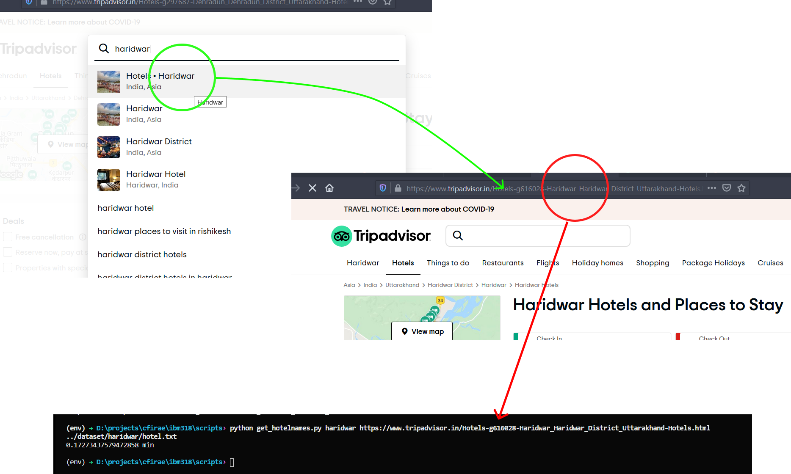

# Opinion Mining of Reviews

## Table of Contents

* [Installation](#installation)
* [Dataset Creation](#dataset-creation)
  * Scrap Hotels
  * Scrap Reviews

## Installation

```bash
git clone https://github.com/projectb33/IBM318.git
pip install -r requirements.txt
```

## Dataset Creation

* Scrap Hotels for a particular Location(city)

```bash
cd scripts
python get_hotelnames.py <LOCATION_NAME> <TRIPADVISORURL>
``` 

Example:


* Scrap Hotel Reviews

```bash
cd scripts
python get_reviews.py <LOCATION_NAME>
```