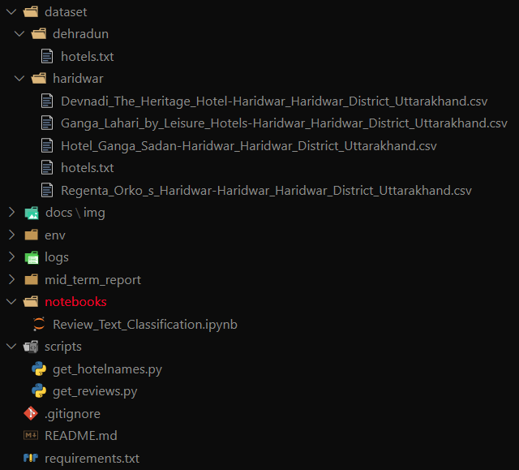

# Opinion Mining of Reviews

## Table of Contents

* [Installation](#installation)
* [Folder Structure](#folder-structure)
* [Dataset Creation](#dataset-creation)
  * Scrap Hotels
  * Scrap Reviews
* [Sample Dataset](#sample-dataset)

## Installation

```bash
git clone https://github.com/projectb33/IBM318.git
pip install -r requirements.txt
```

## Folder Structure



## Dataset Creation

* Scrap Hotels for a particular Location(city)

```bash
cd scripts
python get_hotelnames.py <LOCATION_NAME> <TRIPADVISORURL>
``` 

Example:


* Scrap Hotel Reviews

```bash
cd scripts
python get_reviews.py <LOCATION_NAME>
```

## Sample Dataset

* Preprocessed Dataset

|  location | review | name | user_profile | userloc | rating |
|  -- | -- | -- | -- | -- | -- |
| haridwar | Stayed for 2 nights with family. It’s an excellent place to get the feel of Ganga. The hotel... | Randeep | /Profile/Randeepbora | New Delhi, India | 40 |
| haridwar | Loved our stay, amazing location right by the bank of the Ganges (with the facility of a private Ghat)... | Shayari Banerjee |/Profile/shayarib3499 |  NA | 50 |